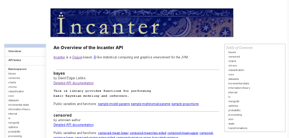
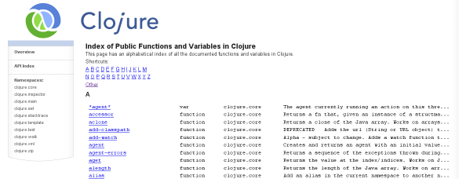

Autodoc - an automated documentation system for Clojure
=======================================================

Introduction
------------

Autodoc is a system for generating HTML documentation for Clojure
projects. It is used to create the up-to-the minute published API
documentation for [Clojure
itself](http://richhickey.github.com/clojure), 
the [Clojure-contrib
library](http://richhickey.github.com/clojure-contrib), and the
statistics package, [Incanter](http://liebke.github.com/incanter).

Autodoc leverages two aspects of Clojure in particular:

* Clojure supports documentation strings on all variables (including functions
  and macros)
* Clojure projects are organized into namespaces.

When run over a project, Autodoc will generate:

1. An overview page (called index.html) with a description of the
project, and an overview of each namespace (from the namespace's
metadata) with a list of documented, public variables and functions in
that namespace. 

    

2. A page for each namespace in the project which has the detailed
documentation for each variable, function and macro. This includes
name, type, usage and documentation. 

    

3. A global index of all the documented variables, their namespace,
and a snippet of their documentation. 

    

By default, Autodoc produces documentation that looks a lot like
Clojure's own API documentation. However, it is possible to customize
both the style and layout of the pages generated by Autodoc to your
tastes.

Autodoc can be run directly from the command line or can be used from
build tools like ant or
[leiningen](http://github.com/technomancy/leiningen).

Running Autodoc
---------------

### Getting Autodoc ###

Unless you are using Autodoc from leiningen, you will need to get a
copy of the standalone jar. Download the latest version from 
[github](http://github.com/tomfaulhaber/autodoc/downloads).

If you're using leiningen, the autodoc code will be pulled
automatically from its home on clojars.org.

### From the command line ###

The simplest way to use autodoc is to launch it from the command line
in the root directory of your project:

    java -jar autodoc-<version>.jar 

This will scan the source in the `src/` directory and produce an
HTML tree in `autodoc/` directory.

To modify the behavior of autodoc, use parameters. For example:

    java -jar autodoc-<version>.jar --source-directory=master

will use the sub-directory `master/` as the location of the source
files.

As shown above, to set parameters from the command line, simply use
options like `--<parameter-name>=<value>` or `--<parameter-name>
<value>`. The full list of available parameters is below.

### Autodoc parameters ###

<table>
<thead>
<tr>
<td>
Parameter
</td>
<td>
Descriptiion
</td>
<td>
Default Value
</td>
</tr>
</thead>

<tr>
<td>
name 
</td>
<td>
The name of this project
</td>
<td>
nil 
</td>
</tr>

<tr>
<td>
param-dir 
</td>
<td>
A directory from which to load custom project data
</td>
<td>
autodoc-params 
</td>
</tr>

<tr>
<td>
root 
</td>
<td>
The directory in which to find the project
</td>
<td>
. 
</td>
</tr>

<tr>
<td>
source-path 
</td>
<td>
The relative path within the project directory where we find the source
</td>
<td>
src 
</td>
</tr>

<tr>
<td>
web-src-dir 
</td>
<td>
The web address for source files (e.g., http://github.com/richhickey/clojure/blob/)
</td>
<td>
nil 
</td>
</tr>

<tr>
<td>
web-home 
</td>
<td>
Where these autodoc pages will be stored on the web (for gh-pages, http://&lt;user&gt;.github.com/&lt;project&gt;/)
</td>
<td>
nil
</td>
</tr>

<tr>
<td>
output-path 
</td>
<td>
Where to create the output html tree.
</td>
<td>
autodoc 
</td>
</tr>

<tr>
<td>
external-doc-tmpdir 
</td>
<td>
The place to store temporary doc files during conversion (i.e., when converting markdown).
</td>
<td>
/tmp/autodoc/doc 
</td>
</tr>

<tr>
<td>
namespaces-to-document 
</td>
<td>
The list of namespaces to include in the documentation, separated by commas
</td>
<td>
nil 
</td>
</tr>

<tr>
<td>
trim-prefix 
</td>
<td>
The prefix to trim off namespaces in page names and references (e.g. "clojure.contrib")
</td>
<td>
nil 
</td>
</tr>

<tr>
<td>
load-except-list 
</td>
<td>
A list of regexps that describe files that shouldn't be loaded
</td>
<td>
[]
</td>
</tr>

<tr>
<td>
build-json-index 
</td>
<td>
Set to true if you want to create an index file in JSON (currently slow)
</td>
<td>
false 
</td>
</tr>

<tr>
<td>
page-title 
</td>
<td>
A title to put on each page
</td>
<td>
nil 
</td>
</tr>

<tr>
<td>
copyright 
</td>
<td>
Copyright (or other page footer data) to put at the bottom of each page
</td>
<td>
No copyright info 
</td>
</tr>
</table>

Integrating Autodoc with your build
-----------------------------------

### Building with Leiningen ###

Autodoc works as a plug-in for Leiningen. This is the very easiest way
to integrate Autodoc into a build process.

Simply add a dev-dependency to your project.clj file:

    :dev-dependencies [[autodoc "0.3.0-SNAPSHOT"]]

Leiningen will automatically pull the code for the autodoc plug-in
from Clojars, so you don't need to worry about installing or anything.

To build the documenation, simply type:

    lein autodoc

Autodoc will set the name, description, and source-path parameters
from the Leiningen configuration. Other parameters can be set via a
map attached to the `:autodoc` key:


    (defproject bugs "0.1.0-SNAPSHOT"
      :description "Statistical routines for thinking about a bugzilla DB"
      :dependencies [[incanter "1.0-master-SNAPSHOT"]
                     [org.clojure/clojure "1.1.0-alpha-SNAPSHOT"]
                     [org.clojure/clojure-contrib "1.0-SNAPSHOT"]]
      :dev-dependencies [[autodoc "0.3.0-SNAPSHOT"]]
      :autodoc { :name "Bugs", :page-title "Bugs API Documentation"})


 
### Building with Ant ### 

### Maven ###

Autodoc currently does not support Maven. It is planned, though. Patches welcome.

Making Autodoc work with source code management
-----------------------------------------------

Customizing Autodoc
-------------------

